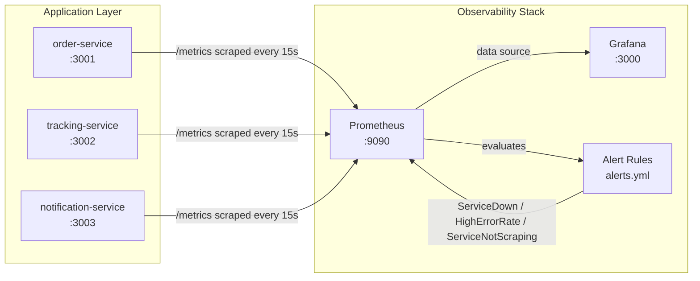
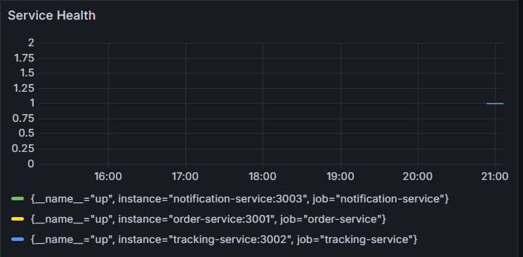
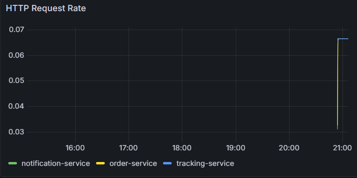
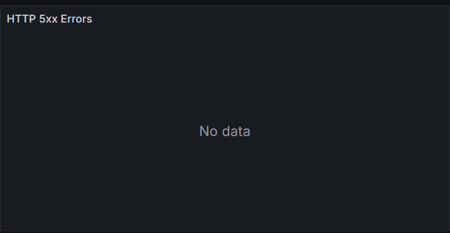
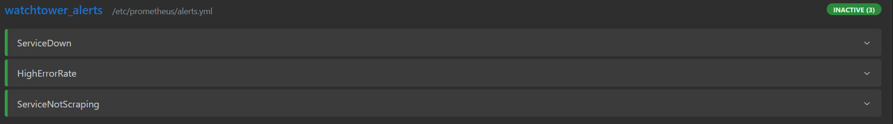
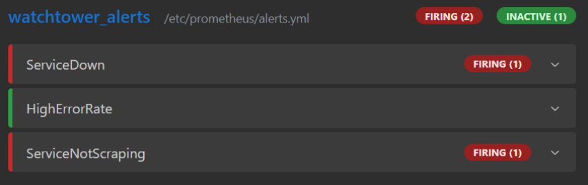
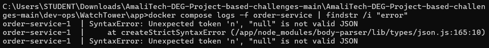

# WatchTower Challenge Documentation

This repository implements a full observability stack with metrics collection, dashboards, and alerting for Reyla Logistics' three backend services (`order-service`, `tracking-service`, `notification-service`). It was built as part of the AmaliTech DEG DevOps challenge.

## 1. Architecture



All five containers run on a shared Docker network created automatically by Compose, so services communicate by name (e.g. `prometheus` reaches `order-service` at `order-service:3001`, not `localhost`).

## 2. Setup Instructions

### Prerequisites
- Docker Desktop installed and running

### Steps

1. Clone this repository and move into the app folder:
   ```bash
   cd app
   ```
2. Copy the environment template and adjust if needed:
   ```cmd
   copy .env.example .env
   ```
3. Start the full stack:
   ```bash
   docker compose up --build
   ```
4. Verify everything is healthy:
   - Service health checks: `http://localhost:3001/health`, `:3002/health`, `:3003/health` → each returns `{"status":"ok",...}`
   - Prometheus targets: `http://localhost:9090/targets` → all three services show **UP**
   - Grafana dashboard: `http://localhost:3000` (login `admin` / `admin`) → **AmaliTech Overview** dashboard loads automatically, no manual import needed

## 3. Variable Reference

| Variable | File | Description |
|---|---|---|
| `ORDER_PORT` | `.env` | Host + container port for `order-service` (default `3001`) |
| `TRACKING_PORT` | `.env` | Host + container port for `tracking-service` (default `3002`) |
| `NOTIFICATION_PORT` | `.env` | Host + container port for `notification-service` (default `3003`) |

## 4. Dashboard Walkthrough

The **AmaliTech Overview** dashboard (`grafana/dashboards/watchtower-overview.json`) is auto-provisioned on startup via Grafana's provisioning system, no manual setup required. It contains three panels:

### Service Health
Built from `up{job=~"order-service|tracking-service|notification-service"}`. `up` is a built-in Prometheus metric per scrape target: `1` means reachable, `0` means down. This is the fastest way to see at a glance whether all three services are alive.



### HTTP Request Rate
Built from `sum(rate(http_requests_total[1m])) by (job)`, requests per second per service, averaged over a rolling 1-minute window.



### HTTP 5xx Errors
Built from `sum(rate(http_requests_total{status=~"5.."}[5m])) by (job)`. This panel correctly shows **No data** during normal operation; Prometheus only stores a series for label combinations that have actually occurred, and since no service had returned a 5xx at the time of this screenshot, there's nothing to plot yet. The panel comes alive the moment any service errors.



## 5. Alert Testing

Three alert rules are defined in `prometheus/alerts.yml`:

| Alert | Condition | Severity |
|---|---|---|
| `ServiceDown` | `up == 0` for 1 minute | critical |
| `HighErrorRate` | 5xx ratio > 5% over a 5-minute window, sustained for 5 minutes | warning |
| `ServiceNotScraping` | `up == 0` for 2 minutes | warning | 



### Testing ServiceDown and ServiceNotScraping (live test)

Both rules key off the same `up` metric, so both can be tested by taking a service down:

```bash
docker compose stop order-service
```

Watching `http://localhost:9090/targets` confirmed `order-service` flipped to down, and `http://localhost:9090/alerts` showed both rules transition **Inactive → Pending → Firing**, in line with their respective `for:` thresholds (1 minute and 2 minutes). Restarting the service (`docker compose start order-service`) confirmed both rules cleared back to **Inactive**.



### Testing HighErrorRate (promtool unit test)

All three services validate their input defensively — malformed or missing JSON bodies are rejected by `body-parser` itself with a 400 before the route logic even runs, and valid-but-incomplete payloads are caught by explicit checks in the route handlers. This makes it impractical to provoke a genuine 5xx from the outside without editing the services' business logic, which the brief specifically asks not to do.

Instead, `HighErrorRate` was verified using `promtool`'s built-in unit testing — the standard way to test Prometheus alerting rules in CI without depending on live traffic. The test (`prometheus/test_high_error_rate.yml`) simulates 5 minutes of 100% failed requests and asserts the alert correctly stays silent early on, then fires by the time the `for: 5m` threshold is met:

```cmd
docker run --rm --entrypoint promtool -v "%cd%\prometheus:/workspace" prom/prometheus:latest test rules /workspace/test_high_error_rate.yml
```

Output:
```
Unit Testing:  test_high_error_rate.yml
  SUCCESS
```
## 6. Logging

All five containers use a shared `json-file` log driver (configured via the `x-logging` anchor in `docker-compose.yml`), with rotation capped at 10MB per file, 3 files retained, preventing unbounded log growth on a long-running host.

**View live logs from all services at once:**
```bash
docker compose logs -f
```



**Filter logs to errors from a specific service** (Windows/CMD shown; swap `findstr /i "error"` for `grep -i error` on Mac/Linux):
```cmd
docker compose logs -f order-service | findstr /i "error"
```

Example output, captured by sending a malformed request (`curl -X POST http://localhost:3001/orders -H "Content-Type: application/json" -d "null"`) while the filtered command was running:


```
order-service-1 | SyntaxError: Unexpected token 'n', "null" is not valid JSON
order-service-1 |     at createStrictSyntaxError (/app/node_modules/body-parser/lib/types/json.js:165:10)
```
